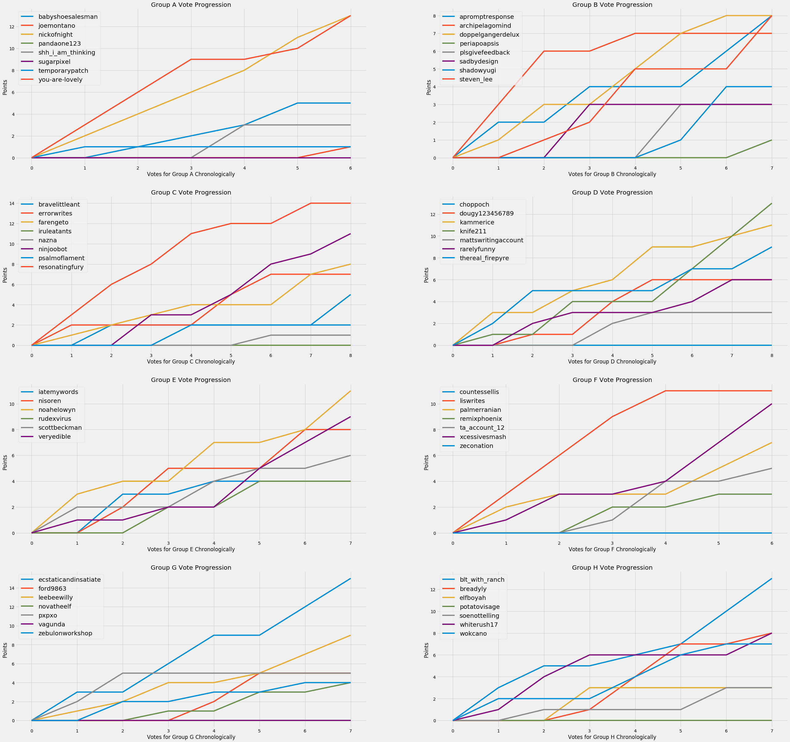

# WPContestBot

Popular subreddit [https://www.reddit.com/r/WritingPrompts/](WritingPrompts) hosts occasional contests where writers are divided into groups and writers in one group vote for those in another, ranking first second third placements, corresponding to 3,2,1 points respectively. This bot parses the contest thread and makes groups and keeps track of the progression of votes for each group, accounting for the various formates commentors may post their results in. 

The end results, chronologically for every group, can be seen in 
